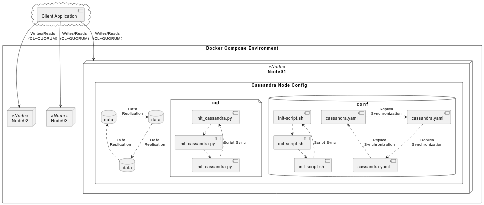

= SPEC-2: Design de Sistemas Distribuídos com Cassandra

== Background

O uso do Cassandra neste projeto de sistemas distribuídos é motivado pela sua capacidade de fornecer alta disponibilidade e tolerância a partições, essenciais para aplicações críticas que necessitam de escalabilidade e resiliência.

== Requirements

. *Capacidade de Nós*: Início com três nós para equilibrar custo e redundância eficaz.
. *Consistência*: Consistência forte nas operações de leitura e escrita, utilizando a política de consistência de quorum.

== Method

=== Configuração do Cluster Cassandra
  - **Número de nós**: 3
  - **Estratégia de replicação**: Cada nó terá uma cópia dos dados, com a estratégia de replicação definida para 'NetworkTopologyStrategy' se houver múltiplas zonas de disponibilidade.
  - **Política de consistência**:
    - **Leitura e Escrita**: Leituras e escritas com consistência de quorum (`CL=QUORUM`), garantindo que a maioria dos nós (2 de 3) participe em cada operação para manter a consistência. No Cassandra, a consistência de quorum garante que as leituras e escritas sejam confirmadas por uma maioria de nós replicados antes de considerar a operação como bem-sucedida. Isso reduz o risco de inconsistências de dados e é ideal para aplicações que não podem tolerar desvios nos dados entre diferentes réplicas. 

=== Arquitetura e Deployment com Docker

  - Uso de Docker para deployment dos nós Cassandra, facilitando a escalabilidade e a manutenção.
  - **docker-compose.yaml**: Este arquivo conterá a definição de todos os serviços necessários para o ambiente do Cassandra, incluindo os próprios nós do Cassandra e qualquer serviço auxiliar necessário.

  - **node**: Diretório para cada nó Cassandra, contendo arquivos de configuração específicos.
  - **conf**: Armazenará o arquivo `cassandra.yaml` personalizado para cada nó.
  - **data**: Diretório de dados para persistência.

=== Estrutura de Diretórios

[source,plaintext]
----
cassandra-cluster
├── docker-compose.yaml
├── common
│   ├── cql
│   │   └── Dockerfile
│   │   └── init_cassandra.py
│   └── credentials
│   │   └── cassandra.credentials
├── node01
│   ├── conf
│   │   └── env
│   │   └── cassandra.yaml
│   │   └── init-script.sh
│   └── data
├── node2
│   ├── conf
│   │   └── env
│   │   └── cassandra.yaml
│   │   └── init-script.sh
│   └── data
├── node03
│   ├── conf
│   │   └── env
│   │   └── cassandra.yaml
│   │   └── init-script.sh
│   └── data
├── docs
│   ├── diagram
│   │   └── cassandra-cluster-diagram.wsd
│   └── image
│   │   └── cassandra-cluster-diagram.png
│   └── spec-cassandra-cluster.adoc
|
├── ycsb
│   ├── results
│   ├── db.properties
│   ├── Dockerfile
│   ├── entrypoint.sh
│   └── replica01.properties
│   └── replica02.properties
│   └── replica03.properties
----

=== PlantUML Diagrama do Cluster Cassandra

== Implementation

1. **Setup do Docker Compose**:
   - Criação de `docker-compose.yaml` com a definição de serviços para cada nó usando a imagem oficial do Cassandra.
   - Configuração de volumes para persistência e configurações específicas.

2. **Configuração dos Nós**:
   - Ajustes no `cassandra.yaml` para definição dos seed providers, endereços de escuta e diretórios de dados.
   - Inicialização do cluster com `node01` como seed.

3. **Inicialização e Testes**:
   - Utilização do Docker Compose para ativar o cluster.
   - Verificação do status do cluster via `nodetool`.
   - Testes de desempenho com YCSB para benchmarking e análise.

== Milestones

* **M1**: Ambiente configurado e cluster inicializado.
* **M2**: Testes de consistência e performance completos.
* **M3**: Integração completa e teste com sistemas externos.

== Gathering Results

* Análise de performance sob diferentes cargas.
* Testes de failover para validar a resiliência do cluster.